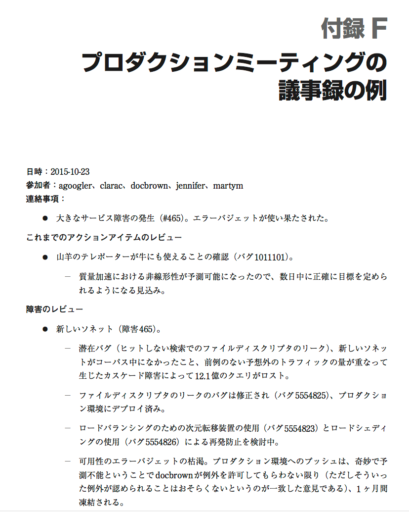
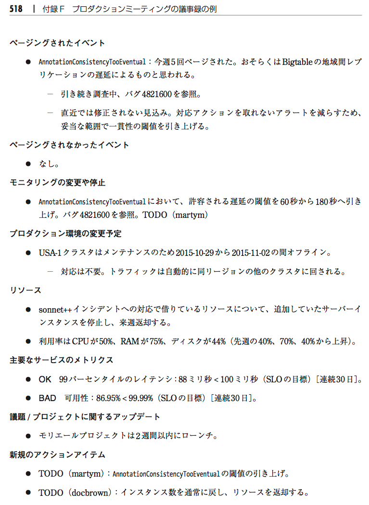

# 31章 SRE におけるコミュニケーションとコラボレーション
- GoogleのSREは様々なチームがある
  - インフラ、サービス、プロダクト横断的なチームなど
- 関係するチームはプロダクト開発チーム
  - 相手の規模は大小様々
  - 時にはSREがプロダクト開発チームになっている時もある
- SREチームには様々なスキルを持つ人々から構成される
  - システム工学やアーキテクチャ
  - ソフトウェアエンジニアリング
  - プロダクトマネージメントのスキルや、リーダーシップのセンス、多様な業界での経験を持つ人々など
- SREは柔軟なチームで、トップダウンのチームではない
- GoogleのSREが熱意を注ぐ2つのこと
  - 一つはサービスやインフラストラクチャの SRE チームの場合、そのサービスやインフラストラクチャの開発を行うプロダクト開発チームと密接な関係の下で働くこと
  - もう一つは、一般的な SRE のコンテキストの下でも働くこと
- SREはサービスのシステムパフォーマンスに対して責任を負うためサービスと強い関係性を持つ一報で、SREとしての組織体系を持っている
- プロダクトをまたぐ業務よりも個々のサービスのサポートに時間を割いているけれども、SREの文化や共有する勝ちは、様々な問題に対して均質的なアプローチを生み出しており、またそのように制度設計がされている。文化は常に戦略に勝る。
- これらがSREのチーム運営に関する2つの報告性を決定づけた。
  - コミュニケーション
  - コラボレーション
    - ソフトウェアエンジニアリングのスキルとシステム工学の専門知識、プロダクション環境の経験から得られる知恵といったものをSREがコラボレーションに振り向けている。
- 最高の設計と 実装は、お互いを尊重する雰囲気の下でプロダクションとプロダクトに対する関心が1つになったときに生まれるもので、それこそが SRE が約束するもの。
- 信頼性に責任を負い、プロダクト開発チームと同じスキルを持つ組織が、物事を目に見えて改善するということ。
- SREの経験は、単純に誰かに信頼性に対する責任を持たせても、その人物が完全なスキルセットを持ちあわせていないのであれば、十分なことにはならないということを示している。
- コミュニケーションは「共有する」、コラボレーションは「共に働く」が語源
  - コミュニケーション
    - 「自分の考えを相手に伝える」だけではなく、相手がその考えを受け取り、さらに理解し「共通の考え」となった時点で初めてコミュニケーションが成立する
  - コラボレーション
    - 「異なる専門性や知識を持つ人たちが1つの目標に向かって協力し、新しい価値を生み出すこと」

- 31.1 コミュニケーション:プロダクションミーティング
- プロダクションミーティング
  - 有益なミーティング
  - SREチームが自分たちと他の参加者に対し、担当するサービスの状況について説明をすることで、すべての関係者の 全般的な認識を高め、サービスの運用を改善するために行われる。
  - サービス指向で行われるもので、直接的に個人の状況のアップデートに関するものではない。
  - 目標:
    - ミーティングが終わった後に、進行中のことに関する全員の認識が同じになること
    - サービスに対するプロダクションの知恵を持ち寄ることによって、サービスを改善すること
  - サービスの運用パフォーマンスの詳細について話し合い、それを設計や設 定、実装と関連づけて考え、問題解決の方法を推奨するということ
  - 定期的なミーティングにおいて設計上の判断をサービスのパフォーマンスと合わせて考えてみることは、きわめて強力な フィードバックループになる
  - 頻度:
    - 毎週
  - 時間:
    - 30分~60分
  - 議長が必須
    - ローテーション制
    - 利点
      - サービスに関わりがあり、問題が自分のものであるという感覚を誰もが持てるようになる
      - 議長としてのスキルを身につけてもらうチャンス
      - SREがインシデント対応中に調整を行わなければならない状況に役に立つ
  - SRE チームがビデオでミーティングをする際にビデオ会議ではデフォルトで人数の少ない側に議長を出してもらうようにすることを推奨
  - チームの人数バランスが崩れていることから生じる悪影響が改善されるから
    - 大きい方のチームはたいてい無意識のうちに小さいチームに話をかぶせてしまう。
    - 邪魔になる私語を抑えることが難しい、 等
- 31.1.1 アジェンタ
  - プロダクション環境において予定されている変更
    - G社ののプロダクション環境では、変更できることがデフォルトであるため、開始時刻、期間、予想される影響など、変更について必要な事項の追跡が求められる。
  - メトリクス
    - レイテンシの値、CPUの利用率の値などが時間の経過につれてどのように変化しているのかを追跡することで、システムのパフォーマンスの変化について議論をする。
  - 障害
    - 学習のために欠かせないもの。
  - ページされたイベント(ページ: 即時対応が必要)
    - このセクションはペー ジのリスト、ページの宛先、ページの後に起きたことなどといった戦術的な視点に立つ
    - ここには、そのアラートのページのされ方は適切だったのか、そしてそもそもそれは ページされるべきものだったのか、という2つの暗黙の質問がある。
  - ページされなかったイベント
    - おそらくはページされるべきだったにもかかわらず、ページされなかった問題
    - ページすべきではないものの、注意を引く必要がある問題
    - ページすべきではなく、注意を引く必要もない問題
  - これまでのアクションアイテム
    - これまでの項目は、何かを修正したり、モニタリングしたり、その他のことを行うサブシステムを開発したりといったアクションへとつながる。
    - これはその、アクションの進捗を追跡するための項目
  - 
  - 
- 31.1.2 出席者
  - 話題に上っている SRE チームだけでなく、 主要なチームは出席すべき
  - 対象となるSREチームのすべてのメンバー
  - 主なステークホルダー
  - プロダクト開発チーム
  - 招待者が多いときや、多忙な相手を招待する時
    - プロダクト開発チームの代表者1人だけにしてもらったり、プロダクト開発チームは議事録†3を読んでコメントしてもらうだけにする
    - プロダクト開発チームが非常に大きいのであれば、代表者を選抜してもらう
    - 多忙でありながら重要な出席者には、他の参加者より前にフィードバックや助言をもらったり、アジェンダへの事前記入の手法を使ったりする
  - Google ドキュメントのリアルタイムコラボレーション機能を使う
    - 「ボトムアップ」のアイデア、コメント、情報を取り入れたアジェンダを事前に用意して おく。
    - アジェンダの準備を並列に、かつ事前に行う。これはきわめて効率的です。
  - Google Docsで利用できる複数ユーザーでのコラボレーション機能をフルに活用しよう 
    - ミーティングの議長が文章を入力し終えた後に他の誰かがソースへのリンクをカッコで加える
    - 他の誰かが元の文章のスペリングや文法を整える
  - これらは参加者にチームでの取り組みに責任感をもたせることができる。
- 31.2 SRE 内でのコラボレーション
  - G社は多国籍企業でチームごとにタイムゾーンをまたがる体制のため、責任、スキル、機会が楽しく も混沌とした状態になる
  - 技術に熟練することは困難なことなので、認知的な負荷を下げるために関連性のあるシステムやインフラストラクチャに熟練する方法を見いだそうとしている
  - チーム X はプロダクト Y だけを扱う、といった方法
    - 技術的な熟練度が高まる可能性が増すという好ましい点がある
    - サイロ化や広い観点を無視するようになりかねないという好ましくない側面もある(サイロ化は企業のある部門が、他の部門と情報共有や連携などをせずに独自に業務を遂行し、孤立した状態を表す語)
    - チームが何をサポートするのか、何をサポートしないのかを規定し、 はっきりとしたチームの目標を持つようにしても、うまくいかないことがある。
- 31.2.1 チームの構成
  - コラボレーションが成功する可能性はチームに多様性を持たせること
  - 以前は、SRE チームには「テックリード」(TL)、「マネージャー」(SRM)、「プロジェクトマ ネージャー」(PM、TPM、PgM 等の呼び名があります)といった役割があった
    - 役割が受け持つ責任範囲がきっちり定義されているので、メリットとして担当範囲内の判断を素早く安全に下せる
    - チームが流動的になればなるほど、チームのメンバーの個人としての能力は発展していき、新しい状況へのチームの対応力は高まるが、前提として共有されている 背景知識は減ることになるので、コミュニケーションの頻度をはるかに高くしなければならない。
  - Google では、マネージャーはきわめて技術色が強いことから、TL はマネージャーの仕事をほぼすべて行えますが、マネージャーは TLが持たない2つの責任を持つ。
    - パフォーマンスの管理と
    - 他の誰かが処理しないものすべてを引き受けるという幅広い役割
- 31.2.2 効率的な作業のための手法
  - １人より複数の人に関わってもらったプロジェクトの方が上手くいく
  - コラボレーションのスキルが必要
  - タイムゾーンのまたぐため、文字のコミュニケーションや出張をする必要が出て来る
  - 先延ばしにしても、直接のやりとりは良い関係を築くためには最終的に必要になる
- 31.3 SRE 内でのコラボレーションのケーススタディ:Viceroy

- 31.3.1 Viceroy 登場
  - SRE間のコラボレーションが成功した例の一つ
  - モニタリングのためのダッシュボードフレームワーク及びサービス
  - あちこちでモニタリングフレームワークの放棄された残骸が大量にくすぶっていた原因は以下
    - それぞれのチームが独自のソリューションを開発することが推奨され、チームの垣根を越えて協力することは困難て
    - SRE全体に対して提供されるような インフラストラクチャはプロダクトというよりはツールキットに近いものであることが普通だった
  - こういった環境要因から、エンジニアは可能な限り大多数の人々のために問題を解決するのではなく、それぞれに提供されたツールキットを使って燃えさかる難破船を増やすことになった
- 31.3.2 課題

- 31.3.3 推奨事項

- 31.4 SRE 外でのコラボレーション
  - プロダクト開発チームとSREのコラボレーションは、設計のフェースで行われると最もうまくいく。
  - 理想はコードがコミットしていない状態から始めるのが理想
  - SREの役割として最も適しているのは、後からの改良が極めて難しいアーキテクチャやソフトウェアの挙動に関する助言をする立場
  - OKR(Objectives & Key Results = 目標と主な結果)プロセスを用いて作業を追跡する。
  - サービスチームによっては、新しい設計の追跡、助言、実装の支援、からプロダクション環境への投入まで行うようなコラボレーションが仕事の中心になっていることもある。
- 31.5 ケーススタディ:DFP における F1 へのマイグレーション
  - 既存のサービスの大規模なマイグレーションプロジェクトはG社ではよくある

- 31.6 まとめ
  - SREチームは世界中に分散しているので、効率的なコミュニケーションは常に優先事項になる
  - SREチーム間でのコラボレーションには固有の課題があるが、そこから問題解決のためのプラットフォームへの一般的なアプローチなど、見返りがある
  - それにより、さらに難しい問題解決に取り組むことができる
